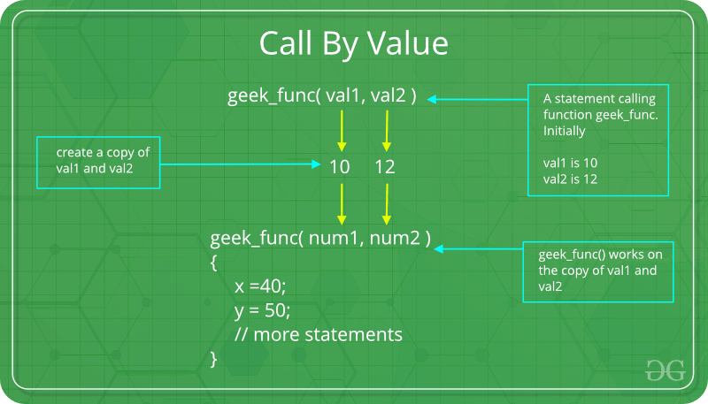

### Hello World!

```C
#include <stdio.h>
int main() {
   // printf() displays the string 
   printf("Hello, World!");
   return 0;
}
```

There are 5 topics one could talk about to explain the "Hello World" code: 

- libraries/header files
- general syntax and program structure
- functions
- strings
- comments

We will eventually discuss them all, but now let's compile our first program. For now, we leave out the "true story" of what's happening and just say that we let the compiler process the code and produce an executable:

```
gcc -o hello.x hello.c
```

The option `-o` stands for "output" and lets you specify a name of the executable. For linux, file extension does not matter and can be ommitted, but please add it anyway to keep the filenames "human readable" and easily addable to `.gitignore`.

_Now might be the time you want to create a .gitignore file for your repository if you haven't yet done it._

All our examples today can just follow the same compilation pattern.

#### Program structure

The minimal program that you can compile is just

```C
int main(){
}
```

Thus, the function `int main()` is the only obligatory element and must be present in any program.

#### C variables and types

We cannot do much without variables, so let's look at how to declare them and which types of variables exist.
The simple example: 

```C
#include <stdio.h>
int main(){
  int a = 7;
  float b = 2.0;
  printf("a = %d, b = %f",a,b);
  return 0;
}
```

"Primitive" types: integers and floating points.

#### Integer types:

short int, unsigned short int, int, unsigned int, long int, long long int, unsigned long long int

The following code prints the limits:

```C
#include <stdio.h>
#include <stdlib.h>
#include <limits.h>
#include <float.h>

int main() {

    printf("CHAR_BIT    :   %d\n", CHAR_BIT);
    printf("CHAR_MAX    :   %d\n", CHAR_MAX);
    printf("CHAR_MIN    :   %d\n", CHAR_MIN);
    printf("INT_MAX     :   %d\n", INT_MAX);
    printf("INT_MIN     :   %d\n", INT_MIN);
    printf("LONG_MAX    :   %ld\n", (long) LONG_MAX);
    printf("LONG_MIN    :   %ld\n", (long) LONG_MIN);
    printf("SCHAR_MAX   :   %d\n", SCHAR_MAX);
    printf("SCHAR_MIN   :   %d\n", SCHAR_MIN);
    printf("SHRT_MAX    :   %d\n", SHRT_MAX);
    printf("SHRT_MIN    :   %d\n", SHRT_MIN);
    printf("UCHAR_MAX   :   %d\n", UCHAR_MAX);
    printf("UINT_MAX    :   %u\n", (unsigned int) UINT_MAX);
    printf("ULONG_MAX   :   %lu\n", (unsigned long) ULONG_MAX);
    printf("USHRT_MAX   :   %d\n", (unsigned short) USHRT_MAX);
}
```

#### floating point types:

float, double, long double

### Control Flow

#### if
```C
if (TEST_EXPRESSION){
//code
}else{ //else is not obligatory
//code
}
```

here is the list of possible operations:

```C
// Comparison Operators
==  // Equal to
!=  // Not equal to
>   // Greater than
<   // Less than
>=  // Greater than or equal to
<=  // Less than or equal to

// Logical Operators
&&  // Logical AND
||  // Logical OR
!   // Logical NOT
```


You can also use a "ternary operator" to type less for "if statement" (and show off :) )

```
if (CONDITION IS TRUE? if yes do this : if not do this)
```


```C
int x = 5;
if ((x > 0) ? 1 : 0) {
    // this executes since x > 0 evaluates to true
}

``` 

#### loops

#### for
```
for (initializationStatement; testExpression; updateStatement)
{
    // statements inside the body of loop
}
```
for example:

```
for (i=0;i<10;i++){
 printf("%d ",i);
}
```

#### while

```C
while (testExpression) {
  // the body of the loop 
}
```
or

```
do {
  // the body of the loop
}
while (testExpression);
```

You can break out of the loop with `break` or skip to the next iteration with `continue`.

#### case

```C
switch (expression)
​{
    case constant1:
      // statements
      break;

    case constant2:
      // statements
      break;

    ...

    default:
      // default statements
}
```


### Functions

`RETURN_TYPE FUNCTION_NAME(INPUT_PARAMETERS);`

A function has _declaration_ and _definition_ (that can be combined):

`int f();`  <---- declaration only
`int f(){};` <---- definition (combined with definition if it's the first time the function appears)

If a function doesn't return anything, the return type must be `void`.


#### Local and global parameters, scope

_A variable defined in `{ }` only exists within it_

`{}` is called "scope".

```C
#include <stdio.h>

int var2 = 7;//avoid if possible

void funct1(){
 int var;
 var = 5; 
 printf("%d\n", var2); 
}

int main(){
 // printf("%d",var); <---- error: ‘var’ undeclared
 {int var = 8;}
 // printf("%d",var); <---- error: ‘var’ undeclared
 int var =9;
 printf("%d\n", var); 
 printf("%d\n", var2); 
 return 0;
}
```

#### Parameters passing

(a picture from geeksforgeeks.org)



Here the parameters passed will not be modified because the function is working on a copy.

```C
void func(int a, int b)
{
    a += b;
    printf("In func, a = %d b = %d\n", a, b);
}
int main(void)
{
    int x = 5, y = 7;
    // Passing parameters
    func(x, y);
    printf("In main, x = %d y = %d\n", x, y);
    return 0;
}
```

This is inefficient, unless you do need a copy for algorithmic reasons.


```C
void func(int* a, int* b)
{
    *a += *b;
    printf("In func, a = %d b = %d\n", *a, *b);
}
int main(void)
{
    int x = 5, y = 7;
    // Passing parameters
    func(&x, &y);
    printf("In main, x = %d y = %d\n", x, y);
    return 0;
}
```

### Interactive input

Use the function `scanf` to read the user input. It has the same syntax as `printf` (but note that you have to pass by reference):

```C
scanf("%d",&val);
```


### Arrays (static)

`TYPE NAME[NUMBER]`, for example `int ar[10]`.

Indexing starts at 0.

`NUMBER` needs to be known at compile time, you cannot change it.

To pass array to a function, do:

```C
void function(int arr[]);
...
int myarr[3];
function(myarr)
```

Note: arrays are always passed to functions by reference. You have two ways for the functions signarure - see the following examples:

```C
#include <stdio.h>

// using array syntax
void printArray(int arr[], int size) {
    for (int i = 0; i < size; i++) {
        printf("%d ", arr[i]);
    }
    printf("\n");
}

int main() {
    int arr[5] = {1, 2, 3, 4, 5}; 
    printArray(arr, 5);
    return 0;
}

```

```C
#include <stdio.h>

// pointer syntax
void printArray(int *arr, int size) {
    for (int i = 0; i < size; i++) {
        printf("%d ", arr[i]);
    }
    printf("\n");
}

int main() {
    int arr[5] = {1, 2, 3, 4, 5}; 
    printArray(arr, 5);
    return 0;
}

```


**Accessing arrays out of bounds causes undefined behavior and (possibly) "segmentation fault"**

```C
int ar[5];
int i;
for (i=0;i<=5;i++){
  ar[i]=i;
  printf("%d\n", ar[i]);
}
```

### Working with files

writing:

```C
#include <stdio.h>

main()
{
   FILE *fp;
   fp = fopen("test.txt", "w");
   fprintf(fp, "This is testing...\n");
   fclose(fp);
}
```

reading: 

(a file `input.txt` has 2 numbers in it) 

```C
int main(){
FILE *fp;
int a,b;
fp=fopen("input.txt","r");
fscanf(fp,"%d",&a);
fscanf(fp,"%d",&b);
...
}
```

### Structs

You can combine variables to define a new type. (It is the first step to object oriented programming.)

```C
struct complex{
  double r;
  double im;
};

int main(){
  struct complex p;
  p.r=4;
  p.im = 2.7;
  ...
}
```

This is the first "high performance" thing we draw attention to: *order of fields matters cause of "padding"*

```C
#include <stdio.h>

// Struct with "bad" field order (inefficient due to unnecessary padding)
struct bad_order {
    char c1;    // 1 byte
    int i1;     // 4 bytes
    char c2;    // 1 byte
    int i2;     // 4 bytes
};

// Struct with "good" field order (optimized to minimize padding)
struct good_order {
    int i1;     // 4 bytes
    int i2;     // 4 bytes
    char c1;    // 1 byte
    char c2;    // 1 byte
};

int main() {
    printf("Size of struct with bad order: %zu bytes\n", sizeof(struct bad_order));
    printf("Size of struct with good order: %zu bytes\n", sizeof(struct good_order));

    return 0;
}

```


### Exercise 1

Write a program that asks the user to input 3 parameters for a quadratic equation `ax^2+bx+c=0`, then solve it (complex roots included). Modify it to ask for the name of an input file instead. Print the output into another file as well as standard output.

### Exercise 2

Find a root of equation `x^3-6x^2+11x-6=0` at the interval [-10,10] by the following method:

 - check the signs of the function at the borders of the interval and its middle
 - modify the interval such that the function has different signs at borders (middle becomes one of the new borders)
 - repeat until the interval is smaller than 10^(-9)

### Exercise 3

Write a recursive function (a function that calls itself) to calculate factorial

### Exercise 4

Read the coordinates of the triangle from the file `triangle.txt`. Calculate the area of the triangle. Use a structure to store coordinates. Check your results on some triangle for which you can calulate the area manually.

### Exercise 5

Fill an array of length 10 with random numbers (use `rand()` from `stdlib.h`). Sort it by whatever method you know (bubble sort/merge sort/etc). Print the result to a file.

### Exercise 6

Write a program to convert integers to a binary system and back
