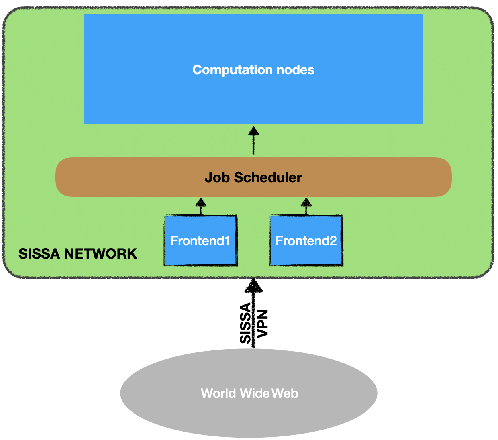

### Connecting to cluster

You have to be connected to SISSA network to be able to access Ulysses. You have to [install SISSA vpn](https://www.itcs.sissa.it/services/network/internal/vpnclient).

Some instructions on the Ulysses's use are [here](https://ulysses.readthedocs.io/how-to-use-ulysses.html#), but sometimes they don't get updated.

`ssh YOUR_SISSA_USERNAME@frontend2.hpc.sissa.it`

You will be prompted for a password.

To close the connection, type `exit`.

If you lose internet, the terminal will hang.
 


To avoid typing the whole ssh address every time, add the following to the `config` file in your `.ssh` folder:

```
Host uly   <----- whatever short name you want to give Ulysses
	User YOUR_USERNAME
	HostName frontend2.hpc.sissa.it
```

To avoid typing the password, copy your public key into a file `authorized_keys` in the folder `.ssh` on the cluster.

If you need to copy a file from your computer to Ulysses, use `scp` (`scp -r` for a folder)

```
scp WHAT WHERE
```

```
scp LOCAL_FILE YOUR_SISSA_USERNAME@frontend2.hpc.sissa.it:/home/YOURUSERNAME/WHATEVERFOLDERYOUHAVE
```

or, if you edited the ssh config file

`scp LOCAL_FILE uly`

do not store big files in your `/home`, use `/scratch` instead

### Task manager

The two most popular ones are `SLURM` and `PBS`. Ulysses uses `SLURM`, so that's what we learn.

#### Submitting a job script

`sbatch JOB_SCRIPT_NAME.sh`

```
#!/bin/bash
#SBATCH --job-name=serial_job_test    # Job name
##SBATCH --mail-type=END,FAIL          # Mail events (NONE, BEGIN, END, FAIL, ALL)
##SBATCH --mail-user=email@ufl.edu     # Where to send mail	
#SBATCH -N 1 # Number of nodes
#SBATCH --ntasks-per-node=1                    # Run on a single CPU
#SBATCH --time=00:05:00               # Time limit hrs:min:sec
#SBATCH -p regular2
#SBATCH --reservation=mhpc20240911
echo "Running script on a single CPU core"

./test.sh
```

#### Useful commands

```
sinfo
```

```
squeue
```

```
squeue -u USERNAME
```

```
squeue -u USERNAME --start`

```

```
squeue -j JOBID
```

```
scancel JOBID
```

Note that reported start times are often inacurate.

### Interactive mode

```
srun -N 1 --tasks-per-node=1 --time=00:01:00 -p regular2 --pty /bin/bash
```

### Environment modules

Modules are mostly used on clusters to manage the environment, but can also be used on laptop if you want to have different software versions with the same names.

### Useful commands

If the installation worked, you can try everything on your machine, otherwise, do it on cluster later.

 - `module av` (from "available") - shows all the modules you can use 
 - `module av 2>&1 | grep "NAME"` - shows all the modules with "NAME" in their name
 - `module list` - list all the currently loaded modules
 - `module load MODULE_NAME` - loads the module
 - `module purge`  - unload all loaded modules
 - `module spider MODULE_NAME` - finds a module and it's possible dependencies. This command is often unavailable. 


### Exercise 1

Write a job that sleeps for 3 minutes. Submit it. Use the `squeue` commands to determine where it is running. Ssh to that node. Try to see your process.

### Exercise 2

Play around with module commands on Ulysses

### Exercise 3 (if you have time, otherwise we will only need it in a month)

follow instructions [here](https://wiki.u-gov.it/confluence/display/SCAIUS/UG3.2%3A+LEONARDO+UserGuide#UG3.2:LEONARDOUserGuide-Access)

and [here](https://wiki.u-gov.it/confluence/display/SCAIUS/How+to+connect+via+2FA)


to configure access to cineca system. 


