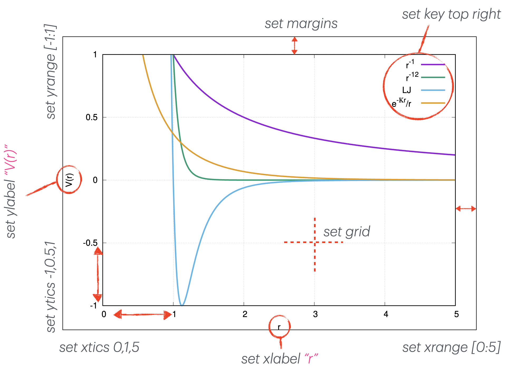

## Gnuplot

[documentation](http://www.gnuplot.info/)

_For people still using WSL it will be easier to just install the Windows version of gnuplot for now_

From the homepage:

"Gnuplot is a portable command-line driven graphing utility for Linux, OS/2, MS Windows, OSX, VMS, and many other platforms. The source code is copyrighted but freely distributed (i.e., you don't have to pay for it). It was originally created to allow scientists and students to visualize mathematical functions and data interactively, but has grown to support many non-interactive uses such as web scripting. It is also used as a plotting engine by third-party applications like Octave. Gnuplot has been supported and under active development since 1986."

Gnuplot produces easily customizable pictures from data files or just pure math functions. The amount of options is overwhelming at first, but once you have a few templates with your favourite styles, plotting new things becomes a breeze. 3D plots are also available.


### Let's start with interactive

just type `gnuplot`

Now you should see the output similar to

```
21:23 $ gnuplot

        G N U P L O T
        Version 5.2 patchlevel 2    last modified 2017-11-15 

        Copyright (C) 1986-1993, 1998, 2004, 2007-2017
        Thomas Williams, Colin Kelley and many others

        gnuplot home:     http://www.gnuplot.info
        faq, bugs, etc:   type "help FAQ"
        immediate help:   type "help"  (plot window: hit 'h')

Terminal type is now 'qt'
gnuplot>
```

now type `plot sin(x)`

If you are lucky, you should see a window with the grapth. Otherwise, your gnuplot didn't get right which terminals can be used on your system.

### The terminal

Gnuplot use a terminal to stamp the plot in langage defined by the terminal.
The terminal type is printed in the login message, or you can view it by typing `show terminal`. 
To view all the terminals available on your system, you can do

```
gnuplot> print GPVAL_TERMINALS
```

or

```
gnuplot> set terminal
```

The latter one gives more information. 
Technically, you do not need a pop-up window, since you would need to save the image anyway, so you can set the terminal to, for example, `pdfcairo` or `png` and define the name of the file receiving the stamp of the plot with the correct extention:

```
set output "myplot.png"
```
and view the resulting pictures manually.
If you do not find any terminals that work for you, see what works for people on similar systems, then google how to download them.

To quit the interactive mode simply type `q` (or `quit`) or `ex` (`exit`).

### Script

It makes sense to use the interactive mode if you just want to quicly see the plot of some function, otherwise you plobably want to set a lot of variables and doing so every time in the interactive mode becomes cumbersome. 
So, you create a script and then run

```bash
$ gnuplot SCRIPT_NAME.gp
```
or 

```bahs
$ gnuplot < SCRIPT_NAME.gp
```
It is also possible to give some argument to gnuplot script:

```bash
$ gnuplot -c script.gp arg1 arg2
```

And to execute the script as an executable:

```bash
#!/usr/local/bin/gnuplot --persist
```
Finally in gnuplot it is possible to load a script:

```
gnuplot> load "file.gp"
```


### Customize your plot

gnuplot is command-line graphic tool very easy to use and accept the script close to bash langage. 
With Gnuplot you can:

- Define a variable, compute and print it:

  ```gnuplot
  A = 1.1
  B = A**6.8
  print A,B
  ```

- Use  intrinsic function (sin, cos, exp, log, ..)

- **plot**: command for 2D graph:

  ```gnuplot
  plot sin(x) title "sinus({/Symbol t})", cos(x) title "cosinus({/Symbol t})"
  ```
  It possible to plot one or many function separated by a comma (`,`).
  The command `{/Symbol ...}` allows to print greek letters.
  The number of point use to plot the dunction can be set 
  
  ```gnuplot
  set sample 100
  ```

- **splot**: command for 3D graph

  ```gnuplot
  splot exp(-(x**2+y**2)/2.)
  ```
  important parameter for the surface plot is the isosample which represent the number of line on your surface

  ```gnuplot
  set isosample 50
  ```

- Cutomize the output
  It shows here some command to customize the output. Gnuplot accept some special character
  - Index and exponent in text:`"I_{0} and V^{2}"` equivalent to I index 0 and V exponent 2
  - Size of the charcater: `set xlabel "{*1.5 distance (cm) }"` police size inside {} will write 1.5 times the size define in font
  - Grec letter: `plot f(x) w l title "sinus({/Symbol q })"` write sinus($\theta$)
  - custom the tics: `set ytics -10,3,15` y tics start from 10 to 15 with step of 3
  - legend position: `set key top center` the legend is at top in center of the graph can be top/middle/bottom with left/center/rigth




```
Create a title:                  > set title "Force-Deflection Data"
Put a label on the x-axis:       > set xlabel "Deflection (meters)"
Put a label on the y-axis:       > set ylabel "Force (kN)"
Change the x-axis range:         > set xrange [0.001:0.005]
Change the y-axis range:         > set yrange [20:500]
Have Gnuplot determine ranges:   > set autoscale
Move the key:                    > set key 0.01,100
Delete the key:                  > unset key
Put a label on the plot:         > set label "yield point" at 0.003, 260
Remove all labels:               > unset label
Plot using log-axes:             > set logscale
Plot using log-axes on y-axis:   > unset logscale; set logscale y
Change the tic-marks:            > set xtics (0.002,0.004,0.006,0.008)
Return to the default tics:      > unset xtics; set xtics auto
```


A large collection of plots and scripts that generated them can be found [here](http://gnuplot.sourceforge.net/demo/) and [here](https://commons.wikimedia.org/w/index.php?title=Category:Images_with_Gnuplot_source_code). 
Start by looking for a plot similar to what you need, copy the scripts, then modify to your taste.


 


### Read data file

Extracted from [tutorial](https://people.duke.edu/~hpgavin/gnuplot.html).
For example your data file, `force.dat`, might look like:

```
      # This file is called   force.dat
      # Force-Deflection data for a beam and a bar
      # Deflection    Col-Force       Beam-Force 
      0.000              0              0    
      0.001            104             51
      0.002            202            101
      0.003            298            148
      0.0031           290            149
      0.004            289            201
      0.0041           291            209
      0.005            310            250
      0.010            311            260
      0.020            280            240
```

You can display your data by typing:

```
      gnuplot>  plot  "force.dat" using 1:2 title 'Column', \
                      "force.dat" using 1:3 title 'Beam'
```

Do not type blank space after the line continuation character, "\" .
Your data may be in multiple data files. In this case you may make your plot by using a command like:

```
      gnuplot>  plot  "fileA.dat" using 1:2 title 'data A', \
                      "fileB.dat" using 1:3 title 'data B'
```

### Histogram

The histogram is not the most easy thing to do with gnuplot.
A nice [tutorial](https://ict4g.net/adolfo/notes/emacs/gnuplot-histogram.html)


### Example of script
Plot histogram:

```bash
reset

set boxwidth 0.5
set grid ytics linestyle 0
set style fill solid 0.20 border

#set terminal png size 1200,800 font "Arial,10"
#set output "histo.png"

set title "Books Borrowed"
set xlabel "Year"
set ylabel "Number of Books"

plot 'data_histo.dat' using 1:2:xtic(1) with boxes lc rgb "#0045FF" title "These are the books I borrowed", \
     'data_histo.dat' using 1:($2+0.25):2 with labels title ""
```

Plot intrinsic function:

```bash
# Define a variable character
TITLE="My_Example"

# Define a function f: x -> sin(x)
f(x) = sin(x)

# Graph Option
## Define grid on the graph
set grid
## Define the range of coordinate x
set xrange [-pi:pi]
## Define legend of x coordinate
set xlabel "X coord."
## Define legend of y coordinate
set ylabel "Trigonometric Functions"

# Plot the function f With Line and title "sinus",
# plot also function cosinus With Line and title "cosinus"
plot f(x) w l title "sinus", \
     cos(x) w l title "cosinus"
## NB: Character \ means continue next line, BUT no space after the character \.

# Save output
## Define the kind of terminal/format I want to use
## Here encapsulated postscript format with color and font Helvetica with police size 20
set terminal postscript enhanced color font "Helvetica,20"
## Define the output file name
set output TITLE.".eps"  # operator . allows to concatenate 2 string
## I replot the actual graph state
replot
```


### Exercise 1:

Plot a family of 5 parabolas. The plot should display their equations, have x and y marks along the axes and the grid shown.

### Exercise 2:

Create a file with 1000 values each being a random number from 1 to 20. Plot a nice looking histogram. You can use [these](http://www.phyast.pitt.edu/~zov1/gnuplot/html/histogram.html) for inspiration.

### Exercise 3:

Make a 3d plot of some function (play around with sin() and exp() to get something interesting)

### Exercise 4:

Complete the script `gif.gp` in `data_dir`.


