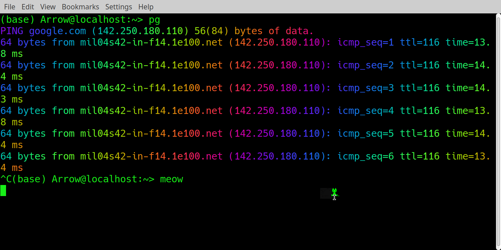

### Essential commands

 `pwd` (print working directory)

 `ls` (what's in the directory we are in)

 `ls -a` (now with hidden files)

 `ls -la` (long format)
 
 `ls -ltr` (to have them reverse-ordered by time, very useful when you want to check some recent output)   

The first 10 characters are permissions (`drwxrwxrwx` means **d**irectory that user, group and "other" can **r**ead **w**rite e**x**ecute. If a letter is replaced by "-" then permission is denied), then user group, file size, date last accessed, and the filename.

Permissions can be changed with `chmod` which works on the binary number so `chmod 644 file.txt` makes file.txt readable by anyone and writable by the owner only. Explanation: `6` in binary is `110` which translates to `rw-` for user and 4 in binary is `100` which translates to `r--` for everyone else.  See `man chmod` for many other options.

`mkdir` to make directory


`cd FOLDER_NAME` to change directory

`cd ..` to get up one level (`cd ../../../../..` for many levels)

Just cd gets you to `/home/USER`.

`cd -` gets you to a previous location, this is especially useful if you accidentally pressed enter after typing `cd`.

`tree` to see the structure

`touch FILENAME` to create a file

`rm FILENAME` to remove a file

`rm -r FOLDER_NAME` to remove a directory (be careful with `rm -rf`!)

`cp FILE_TO_COPY RESULTING_FILE`

`mv` to move a file to a different directory or rename


`find . -name "*.txt"` to search for all .txt file in a directory 

`grep` to find text in a file:

```
echo "hello world" > hello.txt
grep "hello" *.txt
grep -nr "hello" .
```

To simply read a file to see what is in it we can use `cat`, `head`, `tail`, `more` or `less`:

```
cat hello.txt
more hello.txt
less hello.txt
tail hello.txt
```

`cat /proc/cpuinfo` to see your cpus information

`cat /etc/os-release` to see which operating system you have 

Note that if you want to "scroll up" in the terminal to see the previous commands output, you (usually) need to hold the shift key while pressing the up/down arrows, otherwise you will only see the history of the commands. As for the history itself, you can "reverse search" it by pressing `CTRL+R` and typing the part of the command you remember.

Another useful navigation info - press `CTRL+a` to go to the start of the command and `CTRL+e` to get back.


### Redirection

We can redirect output from a command to a file (or the contents of another file) with `>` (the file will be created if it doesn't exist)

```
$ ls -l > output.txt
```

There are some extensions to this:
- `>>` appends to the end of a file
- `1>` redirects stdout
- `2>` redirects stderr so only the errors
- `&>` redirects both stdout and stderr

You can also redirect to `/dev/null` which is a "black hole".

The most handy command with redirection:

```
$ history|grep "cd"
```

### Mangaging processes

`ps -A` to list all processes:

`top` for interactive picture

`top -o %MEM` to sort by memory usage (cpu is default on linux)

`man top` for more options

`kill -9 PROCESS_NUMER` to kill a process

### .bashrc and some fun

At login `~/.bashrc` is executed. You can edit it for things you want to change permanently, for example to set aliases:

`alias pg='ping google.com'` 


Linux console doesn't have to be all boring, for example, by installing `lolcat` and `oneko` packages and making aliases in the `.bashrc` like

```
alias pg='ping google.com|lolcat.ruby2.5 -F 0.3'
alias meow='oneko -bg green'
```

you can get the following colorful ping output and a little cat chasing your cursor:

